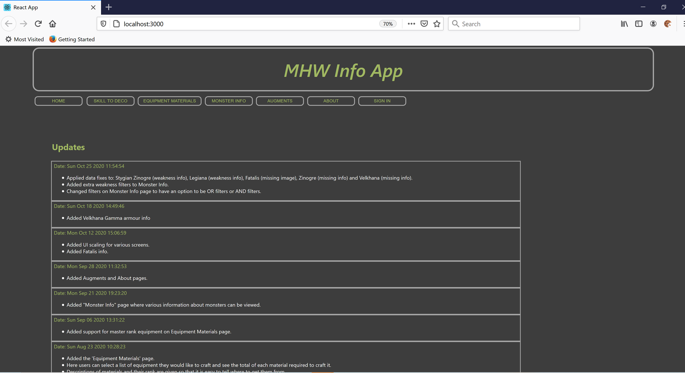
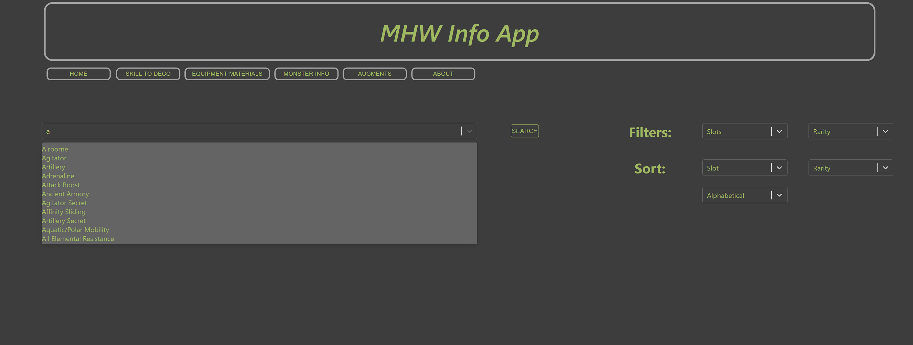
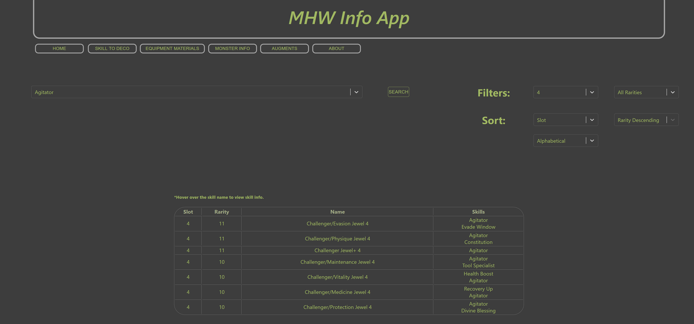
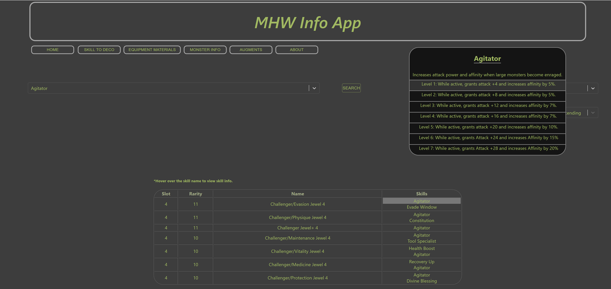
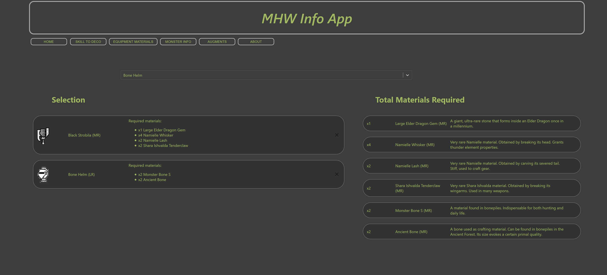
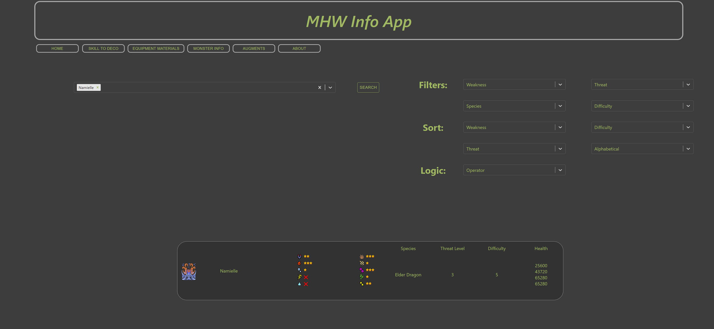
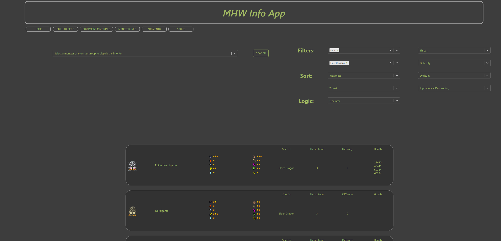
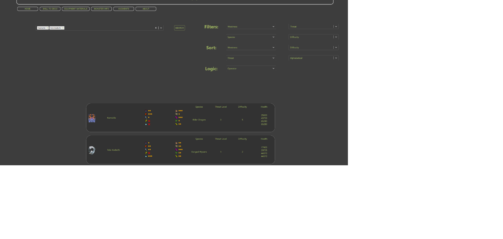
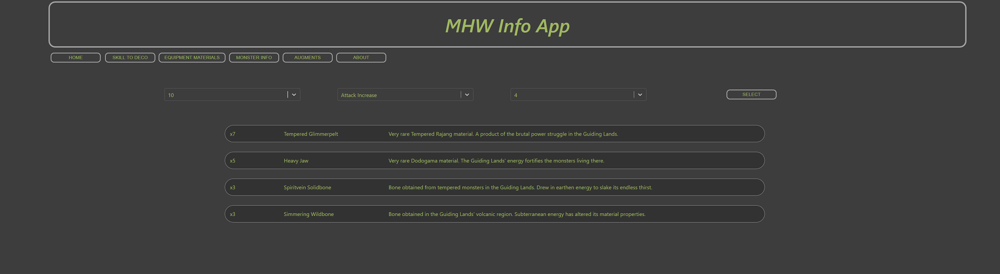

# MHWApp
This is a webapp I decided to make to make it easier to my friends and I to find various information in the Monster Hunter: World game from Capcom, while also learning about React and web scrapping techniques, which is something I wanted to do for some time now. I mostly focused on quality of life improvements that would allow us to not have to have ten different wiki tabs open on our phones while playing. The App uses the MERN stack and used to be deployed on Heroku. The project also uses the MHW API that can be found here: https://docs.mhw-db.com/ as well as its own custom API routes for information not found in the MHW API.

## Main Features

### Home Page
 
*On this page you can see a list of updates for the app and recently added features.* 

### Skill to Deco
 
On this page the user can search for a skill given they preferred filter and sorting criteria and see all decorations that provide that skill.  

 
*Query result.* 

By hovering over the skill name, the user can also see what bonuses the skill offers.  
 

### Equipment Materials
On this page the user can search for equipment that they want to craft and get a list of the required materials along with their descriptions that tell them where the materials are found. This is something that the in-game interface does not allow for often making it cumbersome to keep track of all the materials you need in order to craft several different pieces of equipment.  

 

### Monster Info
On this page the user can search for information on monsters using the various filtering criteria that offer lots of options to show only the exact results a user wants. The monsters can be searched for individually, multiple monster names can be added to the search at ones and various other criteria such as species, weaknesses, threat level and difficulty can be used to narrow down the search.  

 

 

 

### Augments
 

On this page the user can view what materials are required for a specific weapon augment. Information that is not easily obtained in game as the materials for each augment are shown as ??? until the palyer hunts each monster the material comes from in the endgame area of the game. This way the user can focus down specific monsters without having to go in blindly hunting every single one.  
